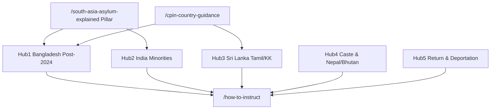

# SEO Architecture — southasiaexpert.com

**Canonical domain:** `https://www.southasiaexpert.com`  
**Site name:** SouthAsiaExpert  
**Locale:** `en_GB` (UK immigration solicitors, law firms, Legal Aid practitioners)

This document is the single source of truth for keyword strategy, unique content assets, content clusters, internal linking, GEO (Generative Engine Optimization), off-page SEO, schema architecture, and launch deployment for southasiaexpert.com. All slugs and URLs align with the canonical routes in `data/` and the App Router.

**Pakistan exclusion:** Pakistan asylum claims are covered separately at `pakistancountryexpert.com`. This site covers Bangladesh, India, Sri Lanka, Nepal, and Bhutan only.

**Implementation status:** Implemented in codebase (June 2026). Canonical slugs, internal linking matrix (`data/related-links.ts`), GEO artifacts, schema, sitemap inventory (`lib/seo/publicUrlInventory.ts`), and 301 redirects (`lib/seo/slug-redirects.ts`, `middleware.ts`) align with this document. Run `npm run seo:verify` after SEO changes.

**Related files:** `data/asylum-profiles.ts`, `data/countries.ts`, `data/guides.ts`, `data/case-types.ts`, `data/glossary.ts`, `data/services.ts`, `data/cpin-data.ts`, `data/profile-geo.ts`, `data/related-links.ts`, `lib/metadata.ts`, `lib/schema.ts`, `lib/constants.ts`, `lib/glossary-links.ts`, `lib/seo/publicUrlInventory.ts`, `scripts/generate-seo.ts`, `scripts/verify-seo.ts`

---

## 1. Keyword Strategy

### Tier 1 — Transactional

**Target pages:** homepage, services, asylum profiles, qualifications, case types, contact.

| Keyword | Primary URL |
|---------|-------------|
| South Asia expert witness UK | `/`, `/what-is-a-south-asia-expert-witness` |
| Bangladesh expert witness UK | `/countries/bangladesh`, `/services#bangladesh-reports` |
| India expert witness UK asylum | `/countries/india`, `/services#india-reports` |
| Sri Lanka expert witness UK | `/countries/sri-lanka`, `/services#sri-lanka-reports` |
| South Asia asylum expert report UK | `/services`, `/how-to-instruct` |
| Bangladesh political persecution expert UK | `/asylum-profiles/political-persecution-south-asia`, `/case-types/bangladesh-political-claims` |
| India Hindutva expert witness UK | `/asylum-profiles/religious-minority-persecution`, `/guides/india-asylum-guide` |
| Sri Lanka Tamil expert witness UK | `/countries/sri-lanka`, `/case-types/sri-lanka-tamil-claims` |
| Legal Aid South Asia expert UK | `/how-to-instruct`, `/guides/instructing-south-asia-expert` |

### Tier 2 — Informational

**Target pages:** pillar page, CPIN hub, guides, asylum profiles, countries, glossary.

| Keyword | Primary URL |
|---------|-------------|
| South Asian asylum claims UK guide | `/south-asia-asylum-explained` |
| Bangladesh asylum 2024 political transition | `/guides/bangladesh-asylum-2024-guide`, `/countries/bangladesh` |
| KK Sri Lanka country guidance 2021 | `/guides/sri-lanka-kk-guide`, `/glossary#kk-and-others-2021` |
| India Muslim minority asylum UK | `/asylum-profiles/religious-minority-persecution`, `/countries/india` |
| LGBTQ+ South Asia asylum UK | `/asylum-profiles/lgbtq-south-asia`, `/countries/bangladesh` |
| South Asia CPIN country guidance | `/cpin-country-guidance`, `/guides/south-asia-cpin-guide` |
| Caste discrimination asylum India Nepal | `/asylum-profiles/caste-discrimination`, `/guides/nepal-bhutan-expert-guide` |
| Tamil diaspora return risk Sri Lanka | `/asylum-profiles/diaspora-activity-risk-on-return`, `/countries/sri-lanka` |

### Tier 3 — Long-tail

**Target pages:** asylum profiles, guides, case types, countries, qualifications.

| Keyword | Primary URL(s) |
|---------|----------------|
| Bangladesh BNP Awami League expert witness UK | `/asylum-profiles/political-persecution-south-asia`, `/glossary#bnp`, `/glossary#awami-league` |
| Post-August 2024 Bangladesh asylum expert | `/services#bangladesh-post-2024`, `/guides/bangladesh-asylum-2024-guide` |
| Hindutva RSS Muslim persecution expert UK | `/glossary#hindutva`, `/glossary#rss`, `/asylum-profiles/religious-minority-persecution` |
| Sri Lanka LTTE association expert witness | `/case-types/sri-lanka-tamil-claims`, `/glossary#ltte` |
| Nepal Dalit caste expert witness UK | `/countries/nepal`, `/glossary#dalit`, `/asylum-profiles/caste-discrimination` |
| Bhutan Lhotshampa expert witness UK | `/countries/bhutan`, `/glossary#lhotshampa` |
| South Asia CPIN challenge expert witness | `/cpin-country-guidance`, `/services#cpin-challenge`, `/case-types/upper-tribunal-south-asia` |
| Journalist persecution Bangladesh India expert | `/asylum-profiles/journalists-human-rights-defenders` |
| Failed asylum seeker return South Asia expert | `/asylum-profiles/failed-asylum-seekers-return`, `/case-types/deportation-return-south-asia` |

### Keyword → URL implementation reference

| Cluster | URL pattern | Meta source |
|---------|-------------|-------------|
| Brand / transactional | `/` | Page-level `createMetadata()` |
| Asylum profile transactional | `/asylum-profiles/{slug}` | `metaTitle`, `metaDescription`, `h1` in `data/asylum-profiles.ts` |
| Pillar / informational | `/south-asia-asylum-explained` | Page-level metadata + Article schema |
| CPIN pillar / informational | `/cpin-country-guidance` | Page-level metadata + `data/cpin-data.ts` |
| Country informational | `/countries/{slug}` | `data/countries.ts` |
| Case-type transactional | `/case-types/{slug}` | `data/case-types.ts` |
| Informational guides | `/guides/{slug}` | `data/guides.ts` |
| Utility / process | `/how-to-instruct`, `/qualifications` | Page-level metadata |
| Services | `/services`, `/services#{id}` | `data/services.ts` |

---

## 2. Unique Content Assets

Five competitive differentiators that distinguish southasiaexpert.com from generic country-expert directories.

| # | Asset | URL(s) | Status |
|---|-------|--------|--------|
| 1 | South Asia asylum pillar — comprehensive solicitor guide | `/south-asia-asylum-explained` | **Live** — Article schema, country statistics table |
| 2 | Country structure — Bangladesh, India, Sri Lanka, Nepal, Bhutan | `/countries`, `/countries/{slug}` | **Live** — full FAQ sections on country pages |
| 3 | Post-August 2024 Bangladesh transition content | `/guides/bangladesh-asylum-2024-guide`, `/countries/bangladesh`, `/services#bangladesh-post-2024` | **Live** — GEO blocks in `data/profile-geo.ts` |
| 4 | KK [2021] Sri Lanka framework analysis | `/guides/sri-lanka-kk-guide`, `/countries/sri-lanka`, `/asylum-profiles/diaspora-activity-risk-on-return` | **Live** |
| 5 | Expert evidence without country guidance (Bangladesh, India, Nepal, Bhutan) | `/south-asia-asylum-explained`, `/cpin-country-guidance` | **Live** — CPIN gap analysis |

---

## 3. Content Clusters

Five topical hubs drive internal linking, anchor text, and content depth. Hub 1 (South Asia Asylum Explained) and `/cpin-country-guidance` connect all profile, country, and case-type spokes.



### Brief slug → canonical slug mapping

| Brief / shorthand | Canonical route |
|-------------------|-----------------|
| `/regions` | `/countries` |
| `/regions/bangladesh` | `/countries/bangladesh` |
| `/moj-country-guidance` | `/south-asia-asylum-explained` |
| `/what-is-a-somalia-expert-witness` | `/what-is-a-south-asia-expert-witness` |
| `/faq` | `/countries` (FAQs on country pages) |
| `/fees` | `/how-to-instruct` |
| `/experts` | `/qualifications` |

### Hub 1: Bangladesh Post-2024

| Role | URL |
|------|-----|
| Pillar | `/south-asia-asylum-explained` |
| Guide | `/guides/bangladesh-asylum-2024-guide` |
| Profile | `/asylum-profiles/political-persecution-south-asia` |
| Profile | `/asylum-profiles/journalists-human-rights-defenders` |
| Country | `/countries/bangladesh` |
| Service | `/services#bangladesh-post-2024` |
| Glossary | `/glossary#bnp`, `/glossary#awami-league` |

### Hub 2: India Minorities

| Role | URL |
|------|-----|
| Profile | `/asylum-profiles/religious-minority-persecution` |
| Profile | `/asylum-profiles/lgbtq-south-asia` |
| Guide | `/guides/india-asylum-guide` |
| Country | `/countries/india` |
| Case type | `/case-types/india-minority-claims` |
| Glossary | `/glossary#hindutva`, `/glossary#rss`, `/glossary#caa` |

### Hub 3: Sri Lanka Tamil / KK

| Role | URL |
|------|-----|
| Profile | `/asylum-profiles/diaspora-activity-risk-on-return` |
| Guide | `/guides/sri-lanka-kk-guide` |
| Country | `/countries/sri-lanka` |
| Case type | `/case-types/sri-lanka-tamil-claims` |
| Glossary | `/glossary#kk-and-others-2021`, `/glossary#ltte` |

### Hub 4: Caste & Nepal/Bhutan

| Role | URL |
|------|-----|
| Profile | `/asylum-profiles/caste-discrimination` |
| Guide | `/guides/nepal-bhutan-expert-guide` |
| Country | `/countries/nepal`, `/countries/bhutan` |
| Glossary | `/glossary#caste`, `/glossary#dalit`, `/glossary#lhotshampa` |

### Hub 5: Return & Deportation

| Role | URL |
|------|-----|
| Profile | `/asylum-profiles/failed-asylum-seekers-return` |
| Case type | `/case-types/deportation-return-south-asia` |
| Guide | `/guides/south-asia-cpin-guide` |
| CPIN | `/cpin-country-guidance` |

### Slug inventory

**Asylum profiles (8):**

`political-persecution-south-asia`, `religious-minority-persecution`, `lgbtq-south-asia`, `caste-discrimination`, `women-gender-based-violence`, `journalists-human-rights-defenders`, `diaspora-activity-risk-on-return`, `failed-asylum-seekers-return`

**Countries (5):**

`bangladesh`, `india`, `sri-lanka`, `nepal`, `bhutan`

**Guides (6):**

`bangladesh-asylum-2024-guide`, `india-asylum-guide`, `sri-lanka-kk-guide`, `south-asia-cpin-guide`, `nepal-bhutan-expert-guide`, `instructing-south-asia-expert`

**Case types (8):**

`ftt-south-asia-appeal`, `upper-tribunal-south-asia`, `sri-lanka-tamil-claims`, `bangladesh-political-claims`, `india-minority-claims`, `deportation-return-south-asia`, `fresh-claims-south-asia`, `certification-challenge`

**Services (8 IDs):**

`bangladesh-reports`, `india-reports`, `sri-lanka-reports`, `nepal-bhutan-reports`, `cpin-challenge`, `internal-relocation`, `bangladesh-post-2024`, `oral-evidence`

### Glossary anchor ID convention

Glossary terms use `slug` from `data/glossary.ts` as the fragment ID (e.g. `#kk-and-others-2021`, `#hindutva`, `#bnp`).

**SEO-critical anchor mappings:**

| Cluster reference | Glossary term | Canonical anchor ID |
|-------------------|---------------|---------------------|
| `#kk` | KK and Others [2021] | `kk-and-others-2021` |
| `#hindutva` | Hindutva | `hindutva` |
| `#bnp` | BNP | `bnp` |
| `#cpin` | CPIN | `cpin` |
| `#caste` | Caste | `caste` |
| `#ltte` | LTTE | `ltte` |
| `#lhotshampa` | Lhotshampa | `lhotshampa` |
| `#hj` | HJ (Iran) [2010] | `hj-iran-2010` |

---

## 4. GEO Optimization Targets

Content structured for AI citation and featured snippets: definition-first, tables, numbered steps, citeable statistics.

| # | GEO target | URL | Required extractable artifact | Implementation |
|---|------------|-----|------------------------------|----------------|
| 1 | South Asia asylum statistics table | `/south-asia-asylum-explained` | Country / claim volume / profiles / CG status table | **Live** — `countries` data on pillar page |
| 2 | Current South Asia CPINs table | `/cpin-country-guidance` | CPIN quick-reference table | **Live** — `cpinRows` in `data/cpin-data.ts` |
| 3 | Post-August 2024 Bangladesh reversal | `/guides/bangladesh-asylum-2024-guide`, `/asylum-profiles/political-persecution-south-asia` | Definition-first summary + dated 2024 context | **Live** — GEO blocks in `data/profile-geo.ts` |
| 4 | KK [2021] framework summary | `/guides/sri-lanka-kk-guide`, `/countries/sri-lanka` | Citeable summary paragraph + risk factors | **Live** |
| 5 | Hindutva national reach (India) | `/asylum-profiles/religious-minority-persecution` | Risk factors highlight block | **Live** — GEO block in `data/profile-geo.ts` |
| 6 | Expert evidence without CG | `/south-asia-asylum-explained`, `/cpin-country-guidance` | Country-by-country CG status checklist | **Live** |

**GEO content rules:**

- Lead with a direct answer paragraph (40–60 words) before depth.
- Tables use `<table>` with header row for accessibility and parsing.
- Include source citations (OSCOLA-style) where statistics, CPIN positions, or country guidance are cited.
- Avoid gating key factual content behind accordions only.

---

## 5. Off-Page SEO Targets

### Directories (listing submissions)

| Directory | URL | Target page to link |
|-----------|-----|---------------------|
| Electronic Immigration Network (EIN) | [ein.org.uk/experts](https://ein.org.uk/experts) | `/`, `/asylum-profiles/*`, `/qualifications` |
| ILPA membership directory | ILPA member directory | `/qualifications`, `/guides/*` |
| Free Movement | [freemovement.org.uk](https://freemovement.org.uk) | `/south-asia-asylum-explained`, `/cpin-country-guidance`, `/guides/*` |
| UNHCR UK | [unhcr.org/uk](https://www.unhcr.org/uk/) | `/south-asia-asylum-explained`, country-condition content |
| Refugee Action | [refugee-action.org.uk](https://www.refugee-action.org.uk/) | `/how-to-instruct` (Legal Aid angle) |

### Digital PR angles

1. **Post-August 2024 Bangladesh Asylum Landscape** — `/guides/bangladesh-asylum-2024-guide`, `/countries/bangladesh`.
2. **KK [2021] and Tamil Diaspora Return Risk** — Hub 3, `/asylum-profiles/diaspora-activity-risk-on-return`.
3. **Hindutva and Internal Relocation in India** — Hub 2, `/asylum-profiles/religious-minority-persecution`.
4. **Expert Evidence Where No UK Country Guidance Exists** — `/south-asia-asylum-explained`, `/cpin-country-guidance`.
5. **Legal Aid Instruction of South Asia Country Experts** — `/guides/instructing-south-asia-expert`, `/how-to-instruct`.

---

## 6. Deployment Checklist

| Task | Implementation | Status |
|------|----------------|--------|
| Netlify deployment | `netlify.toml`, `netlify/functions/submit-lead.js` | Ready |
| DNS: apex → www | `middleware.ts` 301 redirect + registrar `www` CNAME | Code ready |
| `NEXT_PUBLIC_SITE_URL` | `https://www.southasiaexpert.com` in `.env.example`, `lib/constants.ts` | Ready |
| Lead capture (Google Sheets) | `GOOGLE_SERVICE_ACCOUNT_EMAIL`, `GOOGLE_PRIVATE_KEY`, `GOOGLE_SHEET_ID`, `GOOGLE_SHEET_TAB_NAME` | Env-dependent |
| `html lang="en-GB"` | Root layout `<html lang="en-GB">` | **Done** |
| `hreflang` | `en-GB`, `en-US`, `x-default` in `alternates.languages` | **Done** |
| Submit sitemap | GSC + Bing Webmaster — `https://www.southasiaexpert.com/sitemap.xml` | Post-deploy |
| EIN directory submission | ein.org.uk/experts | Manual post-launch |

**Canonical and robots:**

- All pages: canonical via `createMetadata()` in `lib/metadata.ts`
- Staging/preview: `noindex: true` on non-production hosts
- Production: `public/robots.txt` allow `/`, point to sitemap (generated by `npm run seo:generate`)
- Exclude from sitemap: `/contact`, `/thank-you`, `/privacy`, `/terms`
- Robots disallow: `/thank-you`, `/api/`

---

## Appendix A: Full URL Inventory (40 indexable routes)

### Static and hub pages (13)

| URL | Sitemap priority |
|-----|------------------|
| `/` | 1.0 |
| `/south-asia-asylum-explained` | 0.95 |
| `/countries` | 0.95 |
| `/asylum-profiles` | 0.93 |
| `/cpin-country-guidance` | 0.90 |
| `/services` | 0.90 |
| `/what-is-a-south-asia-expert-witness` | 0.90 |
| `/case-types` | 0.88 |
| `/how-to-instruct` | 0.88 |
| `/qualifications` | 0.88 |
| `/guides` | 0.87 |
| `/glossary` | 0.75 |
| `/cookie-policy` | 0.50 |

### Dynamic pages (27)

| Pattern | Count | Sitemap priority |
|---------|-------|------------------|
| `/asylum-profiles/{slug}` | 8 | 0.92 |
| `/countries/{slug}` | 5 | 0.90–0.94 (Bangladesh/India 0.94, Sri Lanka 0.93, Nepal 0.92, Bhutan 0.90) |
| `/case-types/{slug}` | 8 | 0.88 |
| `/guides/{slug}` | 6 | 0.82 |

### Legal / utility (noindex)

| URL | Robots |
|-----|--------|
| `/privacy` | noindex, follow |
| `/terms` | noindex, follow |
| `/thank-you` | noindex, nofollow |
| `/contact` | excluded from sitemap |

**Total indexable URLs:** 40.

**Removed routes (301 redirects):** `/faq` → `/countries`, `/fees` → `/how-to-instruct`, `/experts` → `/qualifications`.

---

## Appendix B: Sitemap Priorities

| Route family | Priority |
|--------------|----------|
| `/` | 1.0 |
| `/south-asia-asylum-explained`, `/countries` (hub) | 0.95 |
| `/countries/bangladesh`, `/countries/india` | 0.94 |
| `/countries/sri-lanka` | 0.93 |
| `/asylum-profiles` (hub) | 0.93 |
| `/asylum-profiles/[slug]` | 0.92 |
| `/countries/nepal` | 0.92 |
| `/cpin-country-guidance`, `/services`, `/what-is-a-south-asia-expert-witness` | 0.90 |
| `/countries/bhutan` | 0.90 |
| `/case-types` (hub), `/case-types/[slug]` | 0.88 |
| `/how-to-instruct`, `/qualifications` | 0.88 |
| `/guides` (hub) | 0.87 |
| `/guides/[slug]` | 0.82 |
| `/glossary` | 0.75 |
| `/cookie-policy` | 0.50 |

---

## Appendix C: Internal Linking Rules

### Rule A — Every `/asylum-profiles/[slug]` must link to:

- `/south-asia-asylum-explained` or `/cpin-country-guidance` (relevant section)
- Relevant `/case-types/[slug]` page(s)
- Relevant `/guides/[slug]` page(s)
- Relevant `/countries/[slug]` page(s) where applicable
- `/how-to-instruct`
- `/contact`

### Rule B — Every `/guides/[slug]` must link to:

- Relevant `/asylum-profiles/[slug]` page(s)
- `/south-asia-asylum-explained` or `/cpin-country-guidance`
- `/how-to-instruct`
- `/contact`

### Additional recommended rules

#### Every `/countries/[slug]` must link to:

- `/countries` hub
- Relevant `/asylum-profiles/[slug]` page(s)
- Relevant `/guides/[slug]` or `/case-types/[slug]` where applicable
- `/cpin-country-guidance`
- `/how-to-instruct`
- `/contact`

#### Every `/case-types/[slug]` must link to:

- Relevant `/asylum-profiles/[slug]` page(s)
- `/how-to-instruct`
- `/contact`

#### `/south-asia-asylum-explained` must link to:

- All 5 `/countries/[slug]` pages (via statistics table + RelatedLinks)
- `/cpin-country-guidance`
- `/asylum-profiles` hub
- `/guides` hub
- `/how-to-instruct`
- `/contact`

#### Homepage must link to:

- Top transactional profiles: political persecution, religious minority, LGBTQ+, failed asylum seekers
- `/south-asia-asylum-explained`
- `/countries` hub
- `/asylum-profiles` hub
- `/guides` hub
- `/how-to-instruct`
- `/contact`

#### Glossary terms must link to:

- Most relevant `/asylum-profiles/[slug]`
- Most relevant `/guides/[slug]` or `/countries/[slug]`
- `/south-asia-asylum-explained` or `/cpin-country-guidance` where applicable

### Enforcement

Implemented via `data/related-links.ts`, `lib/glossary-links.ts`, and the shared `RelatedLinks` component. Matrices enforced in `scripts/verify-seo.ts`. Breadcrumbs on all non-home pages via `PageShell`.

---

## Appendix D: Profile Minimum Links Matrix

Minimum internal links per Rule A. Implement via `getProfileRelatedLinks()` in `data/related-links.ts`.

| Profile slug | Pillar/CPIN | Case types | Guides | Countries |
|--------------|-------------|------------|--------|-----------|
| `political-persecution-south-asia` | `/south-asia-asylum-explained` | `bangladesh-political-claims` | `bangladesh-asylum-2024-guide` | `bangladesh` |
| `religious-minority-persecution` | `/cpin-country-guidance` | `india-minority-claims` | `india-asylum-guide` | `india` |
| `lgbtq-south-asia` | `/cpin-country-guidance` | `india-minority-claims` | `india-asylum-guide` | `bangladesh` |
| `caste-discrimination` | `/cpin-country-guidance` | `india-minority-claims` | `nepal-bhutan-expert-guide` | `india` |
| `women-gender-based-violence` | `/south-asia-asylum-explained` | `ftt-south-asia-appeal` | — | `bangladesh` |
| `journalists-human-rights-defenders` | `/cpin-country-guidance` | `bangladesh-political-claims` | `bangladesh-asylum-2024-guide` | `bangladesh` |
| `diaspora-activity-risk-on-return` | `/south-asia-asylum-explained` | `sri-lanka-tamil-claims` | `sri-lanka-kk-guide` | `sri-lanka` |
| `failed-asylum-seekers-return` | `/cpin-country-guidance` | `deportation-return-south-asia` | `south-asia-cpin-guide` | — |

**All asylum profile pages:** `/how-to-instruct`, `/contact`

### Guide → profile links (Rule B)

| Guide slug | Required profile links |
|------------|------------------------|
| `bangladesh-asylum-2024-guide` | `political-persecution-south-asia` |
| `india-asylum-guide` | `religious-minority-persecution` |
| `sri-lanka-kk-guide` | `diaspora-activity-risk-on-return` |
| `south-asia-cpin-guide` | — (links to CPIN hub and countries) |
| `nepal-bhutan-expert-guide` | `caste-discrimination` |
| `instructing-south-asia-expert` | Top 4 transactional profiles |

---

## Appendix E: Schema Architecture Summary

### Root entity

```json
{
  "@type": "Organization",
  "@id": "https://www.southasiaexpert.com/#organization"
}
```

### Children of Organization

| Type | Count | URL / @id | Notes |
|------|-------|-----------|-------|
| ProfessionalService | 1 | `/` — `#professional-service` | Homepage |
| Service | 8 | `/services#{id}` | See services inventory in Section 3 |
| Article | 1 | `/south-asia-asylum-explained` | Pillar page |
| Article | 1 | `/cpin-country-guidance` | CPIN hub |
| Article | 6 | `/guides/{slug}` | Guide pages |
| FAQPage | 24+ | Dynamic routes with FAQs | Profiles, case types, countries |
| BreadcrumbList | All non-home | Per-page | |
| WebSite | 1 | `/` | SearchAction optional |

### Page → schema template matrix

| Route | JSON-LD types |
|-------|---------------|
| `/` | Organization, ProfessionalService |
| `/services` | Organization, Service ×8 |
| `/south-asia-asylum-explained` | Organization, Article, BreadcrumbList |
| `/cpin-country-guidance` | Organization, Article, BreadcrumbList, FAQPage |
| `/guides/[slug]` | Organization, Article, BreadcrumbList |
| `/asylum-profiles/[slug]` | Organization, BreadcrumbList, FAQPage |
| `/countries/[slug]` | Organization, BreadcrumbList, FAQPage |
| `/case-types/[slug]` | Organization, BreadcrumbList, FAQPage |
| `/glossary` | Organization, BreadcrumbList |
| Static utility pages | Organization, BreadcrumbList |

---

## Appendix F: Recommended Build Order

1. Root layout (`lang="en-GB"`, hreflang), `createMetadata()`, `JsonLd`, Header/Footer
2. Data layer: `asylum-profiles.ts`, `countries.ts`, `case-types.ts`, `guides.ts`, `glossary.ts`, `services.ts`, `cpin-data.ts`
3. Dynamic routes: `/asylum-profiles/[slug]`, `/countries/[slug]`, `/case-types/[slug]`, `/guides/[slug]`
4. Static pages: `/south-asia-asylum-explained`, `/cpin-country-guidance`, `/services`, `/how-to-instruct`, `/qualifications`, `/glossary`, `/contact`
5. Homepage with top profile links, pillar link, countries hub, guides hub
6. `RelatedLinks` component + Appendix D matrix
7. GEO tables on pillar, CPIN, and profile pages (Section 4)
8. `public/sitemap.xml`, `public/robots.txt` via `npm run seo:generate`, env verification tags
9. `middleware.ts` apex → www redirect + legacy slug redirects
10. Post-launch: EIN and ILPA directory submissions, GSC/Bing sitemap submit

---

## Document control

| Version | Date | Notes |
|---------|------|-------|
| 1.0 | 2026-06-11 | Initial SEO architecture for southasiaexpert.com (adapted from Somalia template) |
